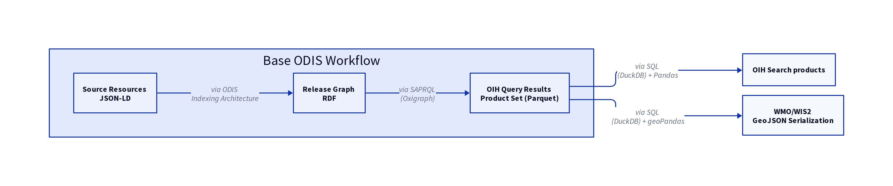

# WIS 2 workflow



The base ODIS workflow is the same for both OIH and WIS2 product generation.

Notes:

> We can save these GeoJSON to an S3 bucket.  We can start events based on bucket triggers which is 
> part of the S3 architecture.  

> Need to align to [https://github.com/iodepo/odis-arch/issues/304#issuecomment-1681333608](https://github.com/iodepo/odis-arch/issues/304#issuecomment-1681333608)   ref: [WMO Core Metadata Profile (WCMP) Version 2
](https://wmo-im.github.io/wcmp2/standard/wcmp2-DRAFT.html)

Notes:
* _crawl-able catalog_ : Collection will be a collection.json (stac ish) that points to our S3 objects via https URL
* SSSOM that maps my SQL to WIS2.0 
* resolve prov via IANA described by that points to the JSON-LD

- [ ] ID:  unique ID in catalog that align to the follow pattern.  We can build this and
  add that action to the PROV graph?  We need an agreement to allow these records to be sent to WMO 
  ``` 
      "id": "urn:x-wmo:md:xxg:odis:$LOCAL_ID"
      xxg  iso 3166 country list
      g = region association a-f  
  ```
- [ ] keywords -> free, properties.themes (concepts and schema)
- [ ] time, can be null, interval, instant  iso8601
- [ ] properties.theme BOILERPLATE
- [ ] conformsTo BOILERPLATE
- [ ] properties.theme, need at least one from   "scheme": "https://github.com/wmo-im/wcmp2-codelists/blob/main/codelists/earth-system-discipline.csv"
- [ ] conforms to, points to json schema  (need to get this)   https://github.com/wmo-im/wcmp2/blob/main/schemas/wcmp2-bundled.json  
- [ ] properties.contacts  Need URL for code list: What is this in our case? Do we have what we need in ODIS/OIH ODISCat to address this?
- [ ] properties.type All datasets for now, maybe services coming? (ref: https://github.com/wmo-im/wcmp2-codelists/blob/main/codelists/resource-type.csv)
- [ ] properties.created is the date the metadata record was created (required) 
	- [ ] may need to be the prov
	- [ ] may need to make required
    - [ ] properties.updated is optional
- [ ] properties.wmo:dataPolicy  BOILERPLATE as "recommended"   still correct?
- [ ] properties.externalIds  
- [ ] properties.links (can be URI or URL to the landing page)


## WCMP Record Core Properties

Review for Required at [The WMO Core Metadata Profile Record](https://wmo-im.github.io/wcmp2/standard/wcmp2-DRAFT.html#_overview_2)

### Required

| Property               | Requirement   | Description                                                                                                                    |
|:-----------------------|:--------------|:-------------------------------------------------------------------------------------------------------------------------------|
| id                     | required      |  Identifier                                                                                                                    |
| type                   | required      | A fixed value denoting the WCMP record as a GeoJSON Feature                                                                    |
| conformsTo             | required      | http://wis.wmo.int/spec/wcmp/2/conf/core                                                                                       |
| properties.type        | required      | dataset   https://github.com/wmo-im/wcmp2-codelists/blob/main/codelists/resource-type.csv                                      |
| properties.title       | required      | check                                                                                                                          |
| properties.description | required      | check                                                                                                                          |
| properties.themes      | required      | ref example at https://github.com/iodepo/odis-arch/issues/304#issuecomment-1681333608                                          |
| geometry               | required      | Geospatial location associated with the dataset, in a geographic coordinate reference system (see Geospatial extent)           |
| time                   | required      | check                                                                                                                          |
| properties.contacts    | required      | does ODIS/OIH have what we need for this?                                                                                      |
| properties.created     | required      | The date that the WCMP record was created.  By us?                                                                             |
| links                  | required      | Online linkages to data retrieval or additional resources associated with the dataset (see Links and distribution information) |

conformance property?


### All


| Property | Requirement | Description |
|---|---|---|
| id | required | A unique identifier of the dataset (see Identifier) |
| type | required | A fixed value denoting the WCMP record as a GeoJSON Feature (see Validation) |
| conformsTo | required | The version of WCMP associated that the record conforms to (see Conformance) |
| properties.type | required | The resource type described by the WCMP record (see Properties / Type) |
| properties.title | required | A human-readable name of the dataset (see Properties / Title) |
| properties.description | required | A free-text summary description of the dataset (see Properties / Description) |
| properties.keywords | optional | Keywords, tags or key phrases (see Properties / Keywords) |
| properties.themes | required | Classifiers, categories and controlled vocabularies (see Properties / Themes) |
| geometry | required | Geospatial location associated with the dataset, in a geographic coordinate reference system (see Geospatial extent) |
| time | required | Temporal extent associated with the dataset (see Temporal extent) |
| additionalExtents.spatial | optional | Additional geospatial extents in other coordinate reference systems (see Additional geospatial extents) |
| additionalExtents.temporal | optional | Additional time instants or periods (see Additional temporal extents) |
| properties.contacts | required | Contact information for the dataset (see Properties / Contacts) |
| properties.version | optional | Version or edition of the dataset (see Properties / Version) |
| properties.externalIds | optional | Persistent identifiers or handles for the dataset (see Properties / Persistent identifiers) |
| properties.created | required | The date that the WCMP record was created (see Properties / Record creation date) |
| properties.updated | optional | The date that the WCMP record was updated (see Properties / Record update date) |
| properties.status | optional | The operational status of the dataset (see Properties / Status) |
| properties.wmo:dataPolicy | conditional | Classification code of core or recommended based on the WMO Unified Data Policy[30]. Required for datasets (see Properties / WMO data policy) |
| properties.rights | optional | A statement that concerns all rights not addressed by the license such as a copyright statement. (see Properties / WMO data policy) |
| links | required | Online linkages to data retrieval or additional resources associated with the dataset (see Links and distribution information) |
| linkTemplates | optional | Online link templates for dynamic / API access (see Templated links) |
| properties.* | optional | Additional properties as needed (see Additional properties) |
