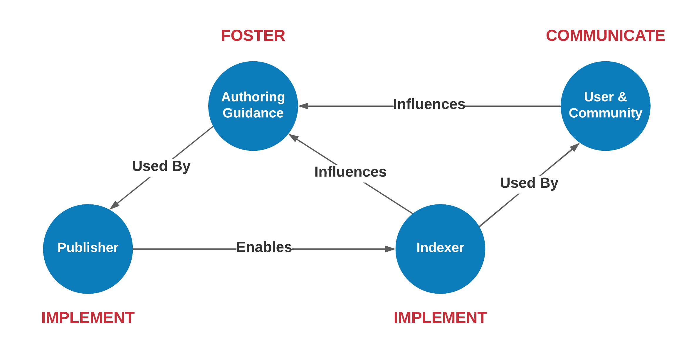

# Engagement

## About

The products of the Ocean InfoHub are quite varied and and such express a range of
potgential engagement opportunites.

The above image is a first attempt at expressing these.  Many of these are still
in active developoment but early links to them are available.  These links follow.

While it is important to express all the various products, it is also importnat realize that some
may have more value at various stages of the project.  Expressed in green above
are two potential early important deliverables that can foster early engagement in 
both the user and community spheres. 

* [The Book](https://book.odis.org/)
* [Search](https://search.oceaninfohub.org/)
* [Dashboard](http://catalogue.gatewaygeo.ca:8501/odis/dashboard/)
* [SPARQL endpoint](http://graph.oceaninfohub.org/blazegraph/#splash)
* [Graph Releases](https://oceans.collaborium.io/releases.html)
* [Decision Records](https://github.com/iodepo/odis-arch/tree/schema-dev-df/decisions)
* [Profiles](https://github.com/iodepo/odis-arch/tree/schema-dev-df/code/dataGraphs)
* [Validation Graphs](https://github.com/iodepo/odis-arch/tree/schema-dev-df/code/SHACL)
* [JSON Schema](https://github.com/iodepo/odis-arch/tree/schema-dev-df/code/JSONschema)
* [Graph Frames](https://github.com/iodepo/odis-arch/tree/schema-dev-df/code/frames)
* [Queries](https://github.com/iodepo/odis-arch/tree/schema-dev-df/code/SPARQL)
* [Validdation of Architecture](https://github.com/iodepo/odis-arch/tree/master/workflows)
* [Validation of Graph Conformance](https://github.com/iodepo/odis-arch/tree/master/workflows)

It is also intrsting to view this in terms of the following:

This image is one I made in the context of the [FAIR Implementation networks](https://www.go-fair.org/implementation-networks/).

