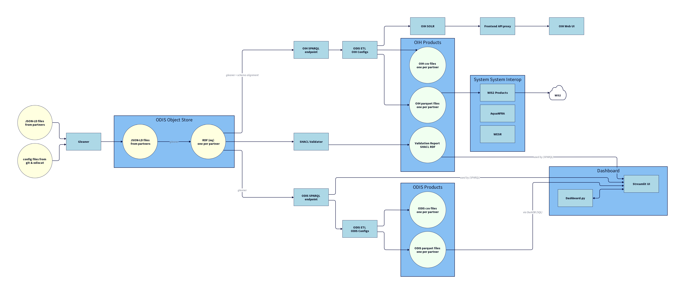
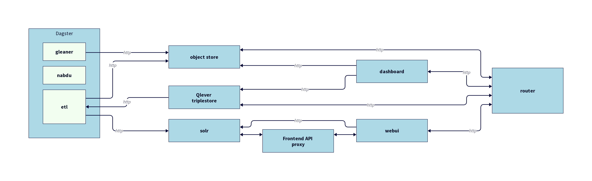

# ODIS / OIH Architecture  

> DRAFT

## About

This page presents various views into the OIDS / OIH architecture.

## Building the images

The images use D2, which is available, at: https://github.com/terrastruct/d2.
Documentation on how to create d2 files is at: https://d2lang.com/tour/intro and
there is nice cheat sheet to start with at: https://d2lang.com/tour/cheat-sheet 

The command to compile and monitor in a browser the image I use is:

```bash
d2 -h workstation.lan -p 4449 --layout elk -t 5 --watch ./sequence.d2 ./sequence.png
```

You can leave out ```--watch``` and ```-h workstation.lan -p 4449``` to just render the image
only.

## Images


### Dataflow

The flow of data through the system and likely the most useful general image.  The image represents
how data and information flow through the system including the processing, storage and query 
activities.  



### High level

An overview of the systems architecture showing the major concepts and conceptual framework.
I need to fix the overlay of the descriptive text on the Partners and Community elements.  


### Deployment

Physical deployment elements.  Each box represents a Docker container run for deployment and 
the communication links.  In our case, these are really all just http(s) calls.  
The small boxes inside "dagster" represent containers that dagster invokes and removes to 
perform workflow tasks.  Note the router may be run as a system level tasks and not container.  

Also, dagster is run inside and communicates with Portainer, so the diagram needs a small update for that. 



### Sequence

> NOT DONE: Missing descriptions and elements

Interaction flows between the various components.


