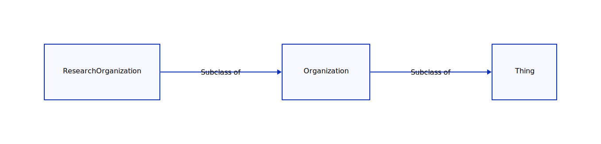

---
jupytext:
  formats: md:myst
  text_representation:
    extension: .md
    format_name: myst
kernelspec:
  display_name: Python 3
  language: python
  name: python3
execution:
  allow_errors: true
---


# Alignment to RDA Data Repository Attributes Working Group (DRAWG)

## About

This document describes an application of schema.org Organization to implement the
[RDA Data Repository Attributes Working Group](https://www.rd-alliance.org/groups/data-repository-attributes-wg)
guidance on repository attributes.

Document Flow

1. Schema.org type Organization
2. JSON-LD
3. Implementation of RDA attributes
4. Validation (SHACL and JSON-schema)
5. Query (SPARQL)
6. Issues encountered

## Schema.org type Organization

Schema.org (https://schema.org/docs/about.html) is a collection of schemas representing
type and properties that canbe used to mark up content on the web. It provides a standardized way of
describing information on the web, making it easier for search engines and other
applications to understand and process the information. 

For people interested in describing research organizations, schema.org provides
several relevant schemas that can be used to mark up information about
research organizations, such as  schema.org/Organization,
schema.org/EducationalOrganization, and the schema.org/ResearchOrganization.



Additionally, types for data, APIs, and various offers an organization can make
are available.

Also, as a vocabulary based on the RDF data model, mappings and leveraging other related
vocabularies such as DCAT is possible.  Beyond integration, there are also mappings that
have been done such as: [ISO 19115 - DCAT - Schema.org mapping](https://www.w3.org/2015/spatial/wiki/ISO_19115_-_DCAT_-_Schema.org_mapping)
and [DCAT v2 schema.org alignment](https://www.w3.org/TR/vocab-dcat-2/#dcat-sdo).

References:

* https://schema.org/Thing
* https://schema.org/Organization
* https://schema.org/ResearchOrganization
* https://github.com/schemaorg/schemaorg/issues/2877

## JSON-LD

[JSON-LD Basics](https://book.oceaninfohub.org/foundation/foundation.html)

## Implementation of RDA attributes

[Example JSON-LD](graphs/organizationv2.json)


## Validation (SHACL and JSON-schema)

SHACL is a W3C recommendation for a language that can be used to define and
validate the structure and content of data stored in RDF graphs. It stands for
SHapes Constraint Language. 

SHACL provides a way to specify constraints on the data in an RDF graph, such as
the required and optional properties for a given class of data, the allowed
values for a property, and the relationships between different classes of data.

These constraints can be used to validate the data in an RDF graph, ensuring
that it adheres to the defined structure and rules. This can help to ensure the
quality and consistency of the data, making it easier to integrate and use with
other systems.

A popular SHACL validation tool is [pySHACL](https://github.com/RDFLib/pySHACL).
It can produce both human and machine focues output.  For machines, the output is
valid RDF which can be used in a triplestore and querried for reports.  

For humans output looks like the following.  Note the use of _Severity_ to 
allow for different types of warnings to be produced.

```bash
pyshacl -s ./shapes/orgShape.ttl -sf turtle  -f human ./graphs/organizationv2.json -df json-ld
```

```turtle
Validation Report
Conforms: False
Results (6):
Constraint Violation in MinCountConstraintComponent (http://www.w3.org/ns/shacl#MinCountConstraintComponent):
        Severity: sh:Violation
        Source Shape: oihval:urlResourceProperty
        Focus Node: <https://example.org/id/org/1>
        Result Path: schema:url
        Message: URL required for the location of the resource described by this metadata
Constraint Violation in MinCountConstraintComponent (http://www.w3.org/ns/shacl#MinCountConstraintComponent):
        Severity: sh:Violation
        Source Shape: oihval:identifierProviderProperty
        Focus Node: <https://example.org/id/org/1>
        Result Path: schema:provider
        Message: A provider must be noted
Constraint Violation in MinCountConstraintComponent (http://www.w3.org/ns/shacl#MinCountConstraintComponent):
        Severity: sh:Violation
        Source Shape: oihval:identifierProviderProperty
        Focus Node: <https://index.example.org/id/org/x>
        Result Path: schema:provider
        Message: A provider must be noted
Validation Result in MinCountConstraintComponent (http://www.w3.org/ns/shacl#MinCountConstraintComponent):
        Severity: sh:Warning
        Source Shape: oihval:keywordsResourceProperty
        Focus Node: <https://example.org/id/org/1>
        Result Path: schema:keywords
        Message: A resource should include descriptive keywords
Validation Result in MinCountConstraintComponent (http://www.w3.org/ns/shacl#MinCountConstraintComponent):
        Severity: sh:Info
        Source Shape: oihval:licenseResourceProperty
        Focus Node: <https://example.org/id/org/1>
        Result Path: schema:license
        Message: Though not required, it is good practice to include a license if one exists
Validation Result in MinCountConstraintComponent (http://www.w3.org/ns/shacl#MinCountConstraintComponent):
        Severity: sh:Info
        Source Shape: oihval:licenseResourceProperty
        Focus Node: <https://index.example.org/id/org/x>
        Result Path: schema:license
        Message: Though not required, it is good practice to include a license if one exists

```

[OIH Book Validation Information](https://book.oceaninfohub.org/validation/README.html)

## Query (SPARQL)

SPARQL is a query language that is used to retrieve and manipulate data stored
in RDF graphs. RDF is a standard for representing information on the web in a
way that allows it to be linked and interconnected with other data. 

[OIH Book SPARQL Information](https://book.oceaninfohub.org/users/query.html)

[Notebook example](https://github.com/iodepo/odis-arch/blob/schema-dev-df/code/notebooks/demos/simpleSPARQL.ipynb)

## Issues encountered

Most concerns are more related to the utility (query, etc) of the graph 
than the ecoding.  It's almost always possible to find a valid approach
to encoding information.  However, that process can cause the discovery
and use of the data to be more difficult.  

### Loose semantics

Some of the concepts present in the RDA working group are a bit difficult
to map into the properties and Types of schema.org.  Exmaples include:

* Persistent identifiers used within your organization
* Deposit
* Content/format

### On leveraging PIDs

PIDs are easy to leverage in schema.org.   Then can can use as altIDs or
Poperty values.  This is just one example of where approaches can vary
and shows where use the of Architecture Decision Records could be of
use.  [(Example ADR reference)](https://github.com/joelparkerhenderson/architecture-decision-record)

```json
  "identifier":
      {
        "@id": "https://doi.org/10.5066/F7VX0DMQ",
        "@type": "PropertyValue",
        "propertyID": "https://registry.identifiers.org/registry/doi",
        "value": "doi:10.5066/F7VX0DMQ",
        "url": "https://doi.org/10.5066/F7VX0DMQ"
      }
```

### External context leveraging

In this exercise the goal was to map the working group properties using only Schema.org.  However,
one could leverage things like Dublin Core, FOAF, or DCAT to address some of the loose
semantics of Schema.org.

The trade off being a more complex context and potentially more compelexity in query space.


## Reference table (late 2022)

See https://www.rd-alliance.org/groups/data-repository-attributes-wg
for the latest information on the output of this group.

| [](https://docs.google.com/document/d/1cNT_IQUUFbDIlT0eCY320LaBz7LjjkenDwYMTVyU6f0/edit)[Attribute:<br>](https://docs.google.com/document/d/1cNT_IQUUFbDIlT0eCY320LaBz7LjjkenDwYMTVyU6f0/edit) | re3data<br>                              | fairsharing                                                                                                                    | [schema.org](http://schema.org/)                                                                                                                                                                                                                                    |
| ---------------------------------------------------------------------------------------------------------------------------------------------------------------------------------------------- | ---------------------------------------- | ------------------------------------------------------------------------------------------------------------------------------ | ------------------------------------------------------------------------------------------------------------------------------------------------------------------------------------------------------------------------------------------------------------------- |
| 1.Name                                                                                                                                                                                         | r3d:repositoryName<br>r3d:additionalName | name                                                                                                                           | schema:name                                                                                                                                                                                                                                                         |
| 2.Repository identifier                                                                                                                                                                        | r3d:re3data ; r3d:repositoryIdentifier   | doi                                                                                                                            | shema:identifier                                                                                                                                                                                                                                                    |
| 3.URL                                                                                                                                                                                          | r3d:repositoryUrl                        | homepage                                                                                                                       | schema:url                                                                                                                                                                                                                                                          |
| 4.Repository description                                                                                                                                                                       | r3d:description                          | description                                                                                                                    | schema:description                                                                                                                                                                                                                                                  |
| 5.Subject/keywords                                                                                                                                                                             | r3d:subject<br>r3d:keyword               | Subjects                                                                                                                       | schema:keywords                                                                                                                                                                                                                                                     |
| 6.Contact                                                                                                                                                                                      | r3d:repositoryContact                    | contacts<br>support\_links                                                                                                     | schema:contactPoint                                                                                                                                                                                                                                                 |
| 7.Geographical location of repository servers and other infrastructure                                                                                                                         | r3d:institutionCountry                   | Country                                                                                                                        | [https://schema.org/location](https://schema.org/location) points to address and also [https://schema.org/VirtualLocation](https://schema.org/VirtualLocation) "location": {<br>"@type": "VirtualLocation",<br>"url": "https://stream.storytimereadings.com/"<br>}, |
| 8.Institution                                                                                                                                                                                  | r3d:institution                          | Organisation                                                                                                                   | schema:member [https://schema.org/parentOrganization](https://schema.org/parentOrganization)                                                                                                                                                                        |
| 9.Persistent identifiers used within your repository                                                                                                                                           | r3d:pidSystem                            | relationship to 'identifier schema' records                                                                                    | offerCatalog \_> service -> serviceOutput -> (thing)propertyValue                                                                                                                                                                                                   |
| 10.API                                                                                                                                                                                         | r3d:api                                  | data processes - any other value than "user interface"                                                                         | offerCatalog                                                                                                                                                                                                                                                        |
| 11.Curation                                                                                                                                                                                    | r3d:qualityManagement                    | data\_curation                                                                                                                 | shcema:publishingPrinciples                                                                                                                                                                                                                                         |
| 12.Deposit                                                                                                                                                                                     | dataUpload,<br>deposit license           | data\_deposition\_condition                                                                                                    | offerCatalog, makesOffer                                                                                                                                                                                                                                            |
| 13.Available Data License/s                                                                                                                                                                    | r3d:dataUploadLicense                    | Licence                                                                                                                        | offerCatalog                                                                                                                                                                                                                                                        |
| 14.Mission statement                                                                                                                                                                           | r3d:missionStatementURL                  |                                                                                                                                | shcema:publishingPrinciples                                                                                                                                                                                                                                         |
| 15.Type of repository                                                                                                                                                                          | r3d:type                                 | registry type; subject and domain tags                                                                                         | [https://schema.org/additionalType](https://schema.org/additionalType)                                                                                                                                                                                              |
| 16.Restrictions to access                                                                                                                                                                      | r3d:dataAccessRestriction                | data\_access\_condition                                                                                                        | [https://schema.org/publishingPrinciples](https://schema.org/publishingPrinciples)                                                                                                                                                                                  |
| 17.Certification                                                                                                                                                                               | r3d:certificate                          | certification and community badges                                                                                             | [https://schema.org/hasCredential](https://schema.org/hasCredential)                                                                                                                                                                                                |
| 18.Content/format                                                                                                                                                                              | r3d:size<br>r3d:contentType              | various places depending on final version of this item                                                                         | makesOffer                                                                                                                                                                                                                                                          |
| 19.Metadata                                                                                                                                                                                    | r3d:metadataStandard                     | relationships to 'standards' records, usually of the reporting guideline, format, or terminology artefact types.               | shcema:publishingPrinciples                                                                                                                                                                                                                                         |
| 20.Preservation                                                                                                                                                                                |                                          | if it is for the data items, then 'data preservation policy'. If it is at the repository level, then 'resource sustainability' | shcema:publishingPrinciples                                                                                                                                                                                                                                         |
| 21.Registries in which the repository is registered                                                                                                                                            | r3d:repositoryIdentifier                 | cross references                                                                                                               | shema:identifier                                                                                                                                                                                                                                                    |
| 22.Collection Content Scope                                                                                                                                                                    | r3d:subject ; r3d:contentType            | subject and domain tags                                                                                                        | [https://schema.org/knowsAbout](https://schema.org/knowsAbout)                                                                                                                                                                                                      |
| 23.Collection Geographic Scope                                                                                                                                                                 |                                          |                                                                                                                                | schema:areaServed                                                                                                                                                                                                                                                   |