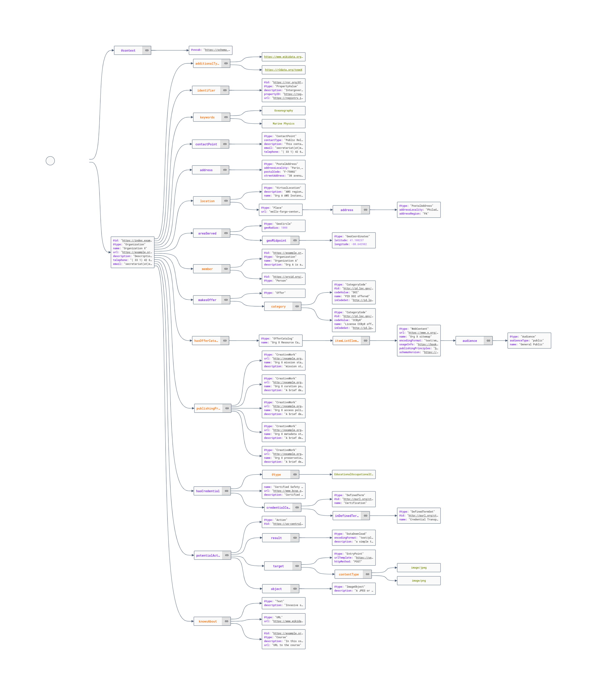

---
jupytext:
  formats: md:myst
  text_representation:
    extension: .md
    format_name: myst
kernelspec:
  display_name: Python 3
  language: python
  name: python3
execution:
  allow_errors: true
---


# Alignment to RDA Data Repository Attributes Working Group (DRAWG)

## About

This document describes the alignment of schema.org Organization with the
[RDA Data Repository Attributes Working Group](https://www.rd-alliance.org/groups/data-repository-attributes-wg)
work on repository attributes.  

Document Flow

1. Schema.org type Organization
2. JSON-LD
3. Implementation of RDA attributes
4. Validation (SHACL and JSON-schema)
5. Query (SPARQL)
6. Issues encountered

## Schema.org type Organization

Schema.org is a collection of schemas, or data categories, that can
be used to mark up content on the web. It provides a standardized way
of describing information on the web, making it easier for search engines
and other applications to understand and process the information. For people
interested in describing research organizations, schema.org provides
several relevant schemas that can be used to mark up information about
research organizations, such as the Organization schema,
the EducationalOrganization schema, and the ResearchOrganization schema.
These schemas allow you to provide information about the research organization,
such as its name, location, and details about the research it conducts. This
can help search engines and other applications to better understand the information
about your research organization and can make it easier for people to
find your organization and learn more about the research you do.

Thing ->  https://schema.org/Organization  -> https://schema.org/ResearchOrganization

https://github.com/schemaorg/schemaorg/issues/2877

## JSON-LD
(move to a refernece elsewhere in the book)

JSON-LD is a way of encoding Linked Data in JSON, the popular data interchange
format used by many web APIs. Linked Data is a method of representing information
on the web in a way that allows it to be linked and interconnected with other data.
This allows data from different sources to be connected and used together in new
and powerful ways. JSON-LD uses a standardized syntax to represent Linked Data,
making it easier to integrate with other systems and tools. It is often used to
add structured data to web pages, making it easier for search engines and other
applications to understand and process the information on the page.

## Implementation of RDA attributes

Full example with highlights as in other docs and JSON-LD framing elements/sections

Implementation document with json crack and playground links




## Validation (SHACL and JSON-schema)

SHACL is a W3C recommendation for a language that can be used to define and
validate the structure and content of data stored in RDF graphs. It stands for
SHapes Constraint Language. RDF is a standard for representing information on
the web in a way that allows it to be linked and interconnected with other data.
SHACL provides a way to specify constraints on the data in an RDF graph, such as
the required and optional properties for a given class of data, the allowed
values for a property, and the relationships between different classes of data.
These constraints can be used to validate the data in an RDF graph, ensuring
that it adheres to the defined structure and rules. This can help to ensure the
quality and consistency of the data, making it easier to integrate and use with
other systems.


## Query (SPARQL)

SPARQL is a query language that is used to retrieve and manipulate data stored
in RDF graphs. RDF is a standard for representing information on the web in a
way that allows it to be linked and interconnected with other data. SPARQL
allows you to query this data using a specialized syntax, similar to SQL. You
can use SPARQL to ask questions about the data in an RDF graph, such as which
entities have a certain property, what values a property has, and how entities
are related to each other. SPARQL can also be used to update the data in an RDF
graph, allowing you to add, delete, and modify data. This makes SPARQL a
powerful tool for working with RDF data and can enable you to do things like
build search engines, integrate data from different sources, and create complex
data-driven applications.

## Issues encountered

Most concerns are more related to the utility (query, etc) of the graph 
than the ecoding.  It's almost always possible to find a valid approach
to encoding information.  However, that process can cause the discovery
and use of the data to be more difficult.  

### On leveraging PIDs

Can use them at altIDs or Poperty values with details

```json
  "identifier":
      {
        "@id": "https://doi.org/10.5066/F7VX0DMQ",
        "@type": "PropertyValue",
        "propertyID": "https://registry.identifiers.org/registry/doi",
        "value": "doi:10.5066/F7VX0DMQ",
        "url": "https://doi.org/10.5066/F7VX0DMQ"
      }
```

### External context leveraging

### Square peg round hole (loose semantics)


## Reference table (late 2022)

See https://www.rd-alliance.org/groups/data-repository-attributes-wg
for the latest information on the output of this group.

Ref: https://tabletomarkdown.com/convert-spreadsheet-to-markdown/

| [](https://docs.google.com/document/d/1cNT_IQUUFbDIlT0eCY320LaBz7LjjkenDwYMTVyU6f0/edit)[Attribute:<br>](https://docs.google.com/document/d/1cNT_IQUUFbDIlT0eCY320LaBz7LjjkenDwYMTVyU6f0/edit) | re3data<br>                              | fairsharing                                                                                                                    | [schema.org](http://schema.org/)                                                                                                                                                                                                                                    |
| ---------------------------------------------------------------------------------------------------------------------------------------------------------------------------------------------- | ---------------------------------------- | ------------------------------------------------------------------------------------------------------------------------------ | ------------------------------------------------------------------------------------------------------------------------------------------------------------------------------------------------------------------------------------------------------------------- |
| 1.Name                                                                                                                                                                                         | r3d:repositoryName<br>r3d:additionalName | name                                                                                                                           | schema:name                                                                                                                                                                                                                                                         |
| 2.Repository identifier                                                                                                                                                                        | r3d:re3data ; r3d:repositoryIdentifier   | doi                                                                                                                            | shema:identifier                                                                                                                                                                                                                                                    |
| 3.URL                                                                                                                                                                                          | r3d:repositoryUrl                        | homepage                                                                                                                       | schema:url                                                                                                                                                                                                                                                          |
| 4.Repository description                                                                                                                                                                       | r3d:description                          | description                                                                                                                    | schema:description                                                                                                                                                                                                                                                  |
| 5.Subject/keywords                                                                                                                                                                             | r3d:subject<br>r3d:keyword               | Subjects                                                                                                                       | schema:keywords                                                                                                                                                                                                                                                     |
| 6.Contact                                                                                                                                                                                      | r3d:repositoryContact                    | contacts<br>support\_links                                                                                                     | schema:contactPoint                                                                                                                                                                                                                                                 |
| 7.Geographical location of repository servers and other infrastructure                                                                                                                         | r3d:institutionCountry                   | Country                                                                                                                        | [https://schema.org/location](https://schema.org/location) points to address and also [https://schema.org/VirtualLocation](https://schema.org/VirtualLocation) "location": {<br>"@type": "VirtualLocation",<br>"url": "https://stream.storytimereadings.com/"<br>}, |
| 8.Institution                                                                                                                                                                                  | r3d:institution                          | Organisation                                                                                                                   | schema:member [https://schema.org/parentOrganization](https://schema.org/parentOrganization)                                                                                                                                                                        |
| 9.Persistent identifiers used within your repository                                                                                                                                           | r3d:pidSystem                            | relationship to 'identifier schema' records                                                                                    | offerCatalog \_> service -> serviceOutput -> (thing)propertyValue                                                                                                                                                                                                   |
| 10.API                                                                                                                                                                                         | r3d:api                                  | data processes - any other value than "user interface"                                                                         | offerCatalog                                                                                                                                                                                                                                                        |
| 11.Curation                                                                                                                                                                                    | r3d:qualityManagement                    | data\_curation                                                                                                                 | shcema:publishingPrinciples                                                                                                                                                                                                                                         |
| 12.Deposit                                                                                                                                                                                     | dataUpload,<br>deposit license           | data\_deposition\_condition                                                                                                    | offerCatalog, makesOffer                                                                                                                                                                                                                                            |
| 13.Available Data License/s                                                                                                                                                                    | r3d:dataUploadLicense                    | Licence                                                                                                                        | offerCatalog                                                                                                                                                                                                                                                        |
| 14.Mission statement                                                                                                                                                                           | r3d:missionStatementURL                  |                                                                                                                                | shcema:publishingPrinciples                                                                                                                                                                                                                                         |
| 15.Type of repository                                                                                                                                                                          | r3d:type                                 | registry type; subject and domain tags                                                                                         | [https://schema.org/additionalType](https://schema.org/additionalType)                                                                                                                                                                                              |
| 16.Restrictions to access                                                                                                                                                                      | r3d:dataAccessRestriction                | data\_access\_condition                                                                                                        | [https://schema.org/publishingPrinciples](https://schema.org/publishingPrinciples)                                                                                                                                                                                  |
| 17.Certification                                                                                                                                                                               | r3d:certificate                          | certification and community badges                                                                                             | [https://schema.org/hasCredential](https://schema.org/hasCredential)                                                                                                                                                                                                |
| 18.Content/format                                                                                                                                                                              | r3d:size<br>r3d:contentType              | various places depending on final version of this item                                                                         | makesOffer                                                                                                                                                                                                                                                          |
| 19.Metadata                                                                                                                                                                                    | r3d:metadataStandard                     | relationships to 'standards' records, usually of the reporting guideline, format, or terminology artefact types.               | shcema:publishingPrinciples                                                                                                                                                                                                                                         |
| 20.Preservation                                                                                                                                                                                |                                          | if it is for the data items, then 'data preservation policy'. If it is at the repository level, then 'resource sustainability' | shcema:publishingPrinciples                                                                                                                                                                                                                                         |
| 21.Registries in which the repository is registered                                                                                                                                            | r3d:repositoryIdentifier                 | cross references                                                                                                               | shema:identifier                                                                                                                                                                                                                                                    |
| 22.Collection Content Scope                                                                                                                                                                    | r3d:subject ; r3d:contentType            | subject and domain tags                                                                                                        | [https://schema.org/knowsAbout](https://schema.org/knowsAbout)                                                                                                                                                                                                      |
| 23.Collection Geographic Scope                                                                                                                                                                 |                                          |                                                                                                                                | schema:areaServed                                                                                                                                                                                                                                                   |