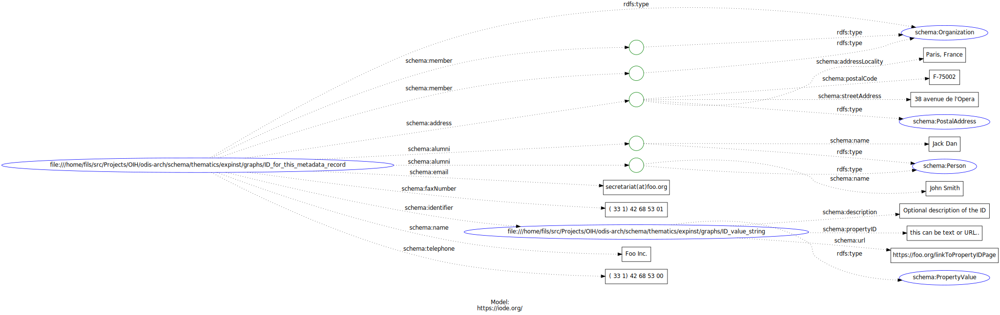

# Experts and Institutions

## About

Expert:  A person who has a deep understanding of a particular subject area.

Institution: A group of people working together to provide a particular service.
  
## Example Person Graph

```{literalinclude} ./graphs/person.json
:linenos:
```


## Example Institution Graph

```{literalinclude} ./graphs/organization.json
:linenos:
```





## References

* [schema:Person](https://schema.org/Person)
* [scheme:Organization](https://schema.org/Organization)
* [Science on Schema Repository](https://github.com/ESIPFed/science-on-schema.org/blob/master/guides/DataRepository.md)
* [https://oceanexpert.org/](https://oceanexpert.org/)
  * [Example page expert](https://oceanexpert.org/expert/44151)
  * [Example page institution](https://oceanexpert.org/institution/10171)
  * [Ocean Expert: refernce: Adam Leadbetter](https://gist.github.com/adamml/58ebdc7fc3f8ab8dad5d8852a28fb28c)
