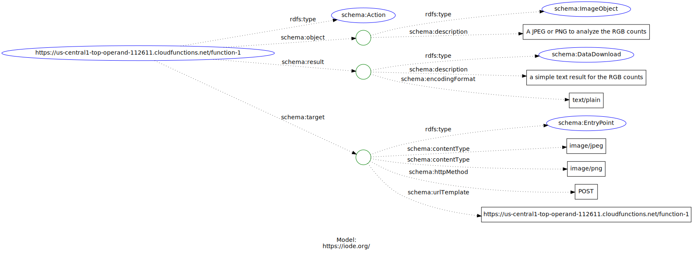

# Services

This section will provide information on the service type.  This is not 
one of the main OIH types.  However, we will provide guidance here on describing
services using schema.org.

It should be noted that this might be a simple link to an OpenAPI or some 
other descriptor document.  Also, schema.org is not rich enough for complex 
descriptions and itself borrows from the [Hydra](https://www.hydra-cg.com/spec/latest/core/)
vocabulary.  It may be required to leverage Hydra if complex descriptions are 
needed.

## Notes


* https://schema.org/docs/actions.html
* https://schema.org/Action
* https://www.w3.org/TR/web-share/
* https://www.hydra-cg.com/spec/latest/core/

The graph describes a service than can be invoked with

```bash
curl --data-binary "@yourfile.jpg" -X POST https://us-central1-top-operand-112611.cloudfunctions.net/function-1
```

This with POST a jpeg to the service and get back a simple text response with some information
about the image.

<!-- embedme ./graphs/action.json -->


```json
{
    "@context": {
        "@vocab": "https://schema.org/"
      },
    "@type": "Action",
    "@id": "https://us-central1-top-operand-112611.cloudfunctions.net/function-1",
    "result": {
      "@type": "DataDownload",
      "encodingFormat": "text/plain",
      "description": "a simple text result for the RGB counts"
    },
    "target": {
      "@type": "EntryPoint",
      "urlTemplate": "https://us-central1-top-operand-112611.cloudfunctions.net/function-1",
      "httpMethod": "POST",
      "contentType": ["image/jpeg", "image/png"]
    },
    "object": {
      "@type": "ImageObject",
      "description": "A JPEG or PNG to analyze the RGB counts"
    }
  }
```





