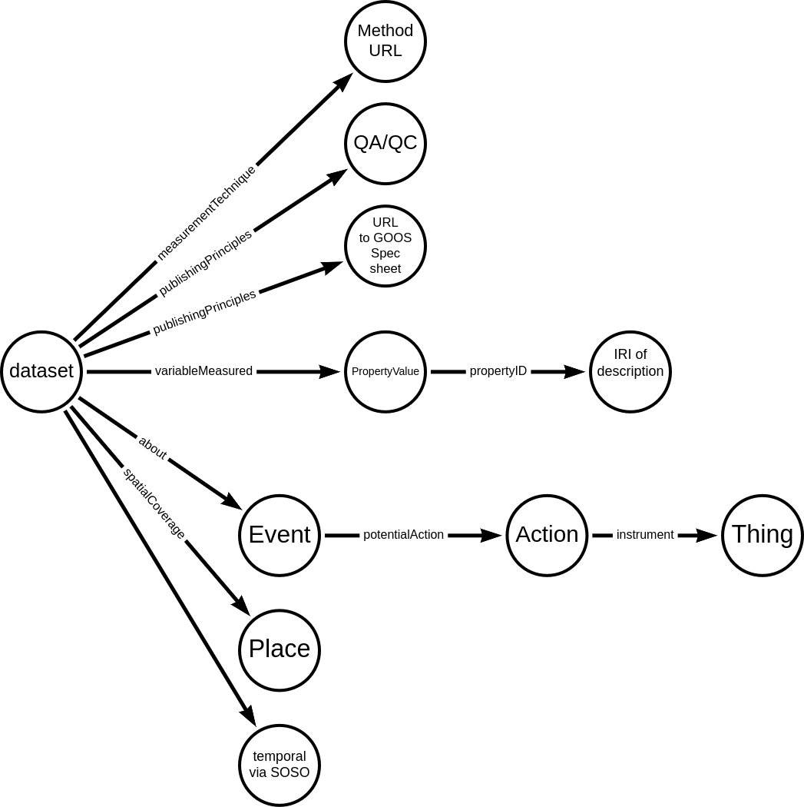

---
jupytext:
  formats: md:myst
  text_representation:
    extension: .md
    format_name: myst
kernelspec:
  display_name: Python 3
  language: python
  name: python3
execution:
  allow_errors: true
---

# Variables


## References:

* [GOOS reference](https://www.goosocean.org/index.php?option=com_content&view=article&layout=edit&id=283&Itemid=441)
* [Goos example spec sheet](https://www.goosocean.org/index.php?option=com_oe&task=viewDocumentRecord&docID=17465) and 
   
* [Dublin core record to map](https://repository.oceanbestpractices.org/handle/11329/1920?show=full) for different, but related, work.


[OBIS examples](https://manual.obis.org/examples/)

Reference image:



```{literalinclude} ./graphs/obisData2.json
:linenos:
```

## measurementTechnique

## publishingPrinciples

## variableMeasured

## about

## spatialCoverage

## temporalCoverage


```{literalinclude} ./graphs/temporalCoverage.json
:linenos:
```


Example from Science on Schema recommendations:
```json
{
  "@context": {
    "@vocab": "https://schema.org/"
    "gsn-quantity": "http://www.geoscienceontology.org/geo-lower/quantity#"
  },
  "@type": "Dataset",
  "name": "Removal of organic carbon by natural bacterioplankton communities as a function of pCO2 from laboratory experiments between 2012 and 2016",
  "variableMeasured": [
    {
      "@type": "PropertyValue",
      "name": "latitude",
      "propertyID":"http://www.geoscienceontology.org/geo-lower/quantity#latitude",
      "url": "https://www.sample-data-repository.org/dataset-parameter/665787",
      "description": "Latitude where water samples were collected; north is positive.",
      "unitText": "decimal degrees",
      "minValue": "45.0",
      "maxValue": "15.0"
    },
  ]
}
```

via [valueReference](https://schema.org/valueReference) we can get to Defined Term  (EVO)

Defined Term  (not scoped in variableMeasured valid types)
```json
{
    "@id": "http://purl.org/dc/dcmitype/Image",
    "@type": "DefinedTerm",
    "inDefinedTermSet": "http://purl.org/dc/terms/DCMIType",
    "termCode": "Image",
    "name": "Image"
},
```


