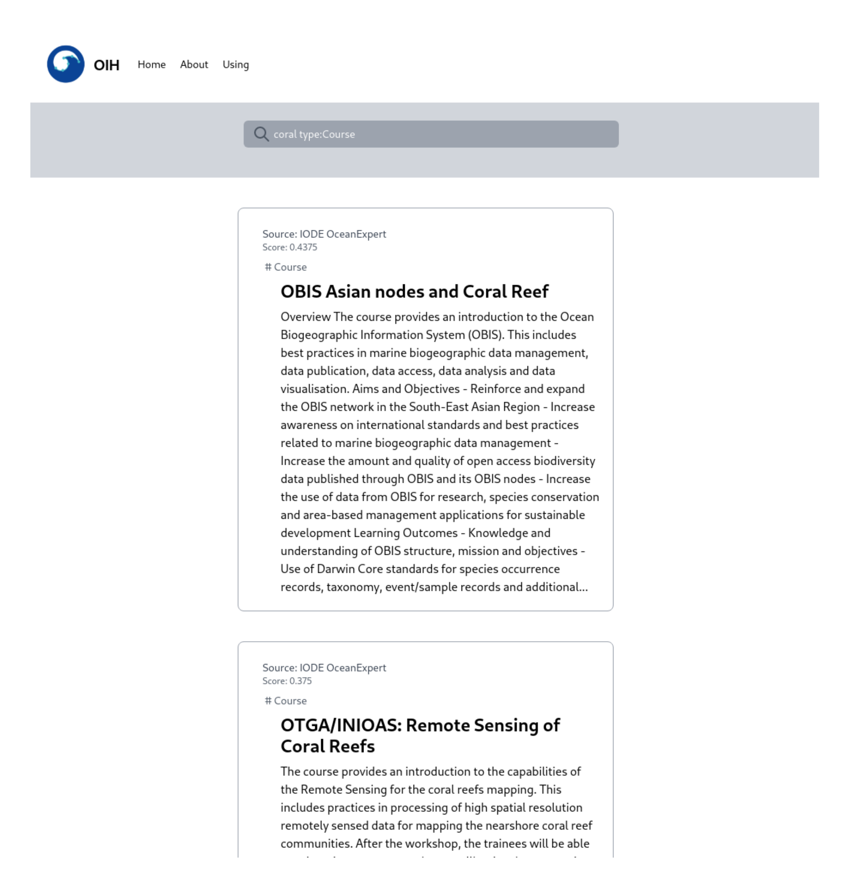

# Users

## About

The reference client used for development is currently hosted at
 [oceans.collaborium.io](https://oceans.collaborium.io/).  This is a fully
 client side Javascript based client to the OIH index.  All the 
 code is hosted at 
 [https://github.com/iodepo/odis-arch/tree/master/schema/client/referenceclient/website](https://github.com/iodepo/odis-arch/tree/master/schema/client/referenceclient/website)

 
