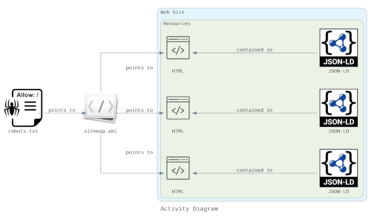
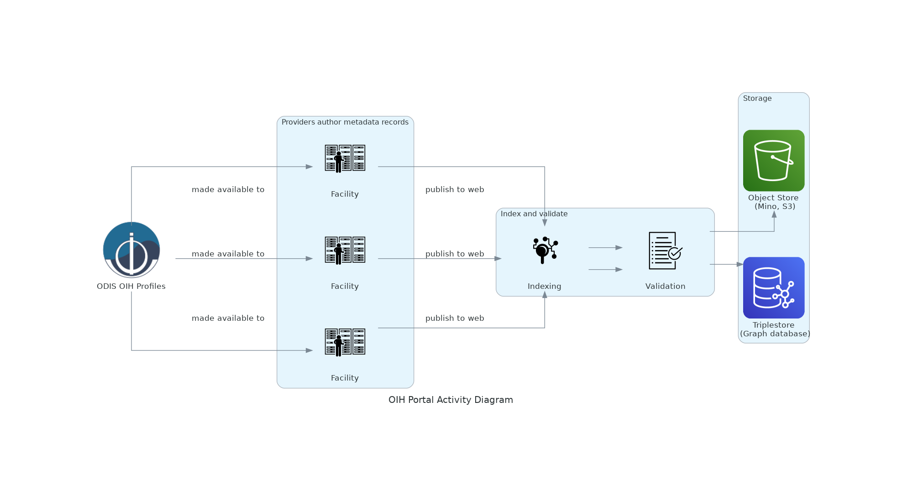

# Publisher

## About

This page describes the publishing process for structured data 
on the web approach OIH will use.  

Note many software packages you are using might already 
implement this approach.  See the section: 
_Existing support in software_ at the bottom of this document.

```{seealso}
We also recommend reviewing the document: 
[Schema.org for Research Data Managers: A Primer](https://docs.google.com/document/d/1fay3uIqIO2rljVBTk6Sk6i1I3yRnVecn-UTl3JKXLnw/edit)
```

### Architecture Implementation

The Ocean Info Hub (OIH) will leverage structured data on the web and web
architecture patterns to expose metadata about resources of interest to the
community.  The primary tasks include:

* Authoring JSON-LD documents (https://json-ld.org/) aligned with ODIS OIH
  guidance to express the structured metadata for a resource.  This step will
  require experience with using the existing metadata resources within an
  organization.  So any necessary skills needed to access or query existing
  facility data systems will be needed to assemble the information to populate
  the JSON-LD data graph.  The JSON-LD documents need to be generated using the
  tools/languages at the previous reference or through other means.  
* Within the system architecture of the site, a JSON-LD document needs to be
  placed into the HTML DOM as a SCRIPT tag within the HEAD tag of each
  published resource.   The SCRIPT tag pattern is:
  
  ```html
  <script type="application/ld+json">JSON_LD content</script>
  ```

* Additionally these resources that are marked up with these tags and JSON-LD
  documents should be expressed in an XML sitemap file.  This should follow the
  guidance at https://www.sitemaps.org/.  It should also include a lastmod node
  element as described at https://www.sitemaps.org/protocol.html which should
  indicate the date the resource metadata was last updated and published to the
  web.  
* The process of aligning the JSON-LD is iterative at this stage as the OIH
  profile is evolved.  To aid this we can leverage existing validation tools
  including JSONSchema, W3C SPARQL and more to communicate structure changes.
  These tools exist and need only be implemented using knowledge of command
  line environments.  The results will then indicate revisions needed in the
  JSON-LD.  OIH will provide the necessary templates for the tools to use
  against the authored JSON-LD documents.  

Information on the sources, standards and vocabularies to be used can be found
at: https://github.com/iodepo/odis-arch/tree/schema-dev/docs 

### Including JSON-LD in your resource page

To provide detailed and semantically described details on a resource, OIH uses
a [JSON-LD](https://json-ld.org/) snippet or _data graph_.  This small document
provides details on the resource.  It can also express any explicate
connections to other resources an author may wish to express.  The semantic
nature of the document also means that connections may later be discovered
through graph queries.

Pages will need a JSON-LD data graph placed in it via a typed script
tag/element in the document head element like the following.  

```html
<script type="application/ld+json"></script>
```

An example data graph can be seen below.   However, check the various
thematic sections for more examples for a given thematic area.  

```json
{
    "@context": {
        "@vocab": "https://schema.org/",
        "endDate": {
            "@type": "http://www.w3.org/2001/XMLSchema#dateTime"
        },
        "startDate": {
            "@type": "http://www.w3.org/2001/XMLSchema#dateTime"
        }
    },
    "@id": "https://foo.org/url/to/metadata/representation",
    "@type": "Course",
    "description": "In this course you will get an introduction to the main tools and ideas in the data scientist's toolbox...",
    "hasCourseInstance": {
        "@type": "CourseInstance",
        "courseMode": [
            "MOOC",
            "online"
        ],
        "endDate": "2019-03-21",
        "startDate": "2019-02-15"
    }
}
```

This example is from the [training and courses thematic
section](https://github.com/iodepo/odis-arch/tree/master/book/thematics/training).  To view all the types
being developed reference
the [Thematic section](https://github.com/iodepo/odis-arch/tree/master/book/thematics).

These JSON-LD documents leverage schema.org as the primary vocabulary.
The examples in the thematic section provide examples for the various type.  

#### JSON-LD Tools and References

A key resource for JSON-LD can be found at [JSON-LD](https://json-ld.org/).
There is also an interactive _playground_ hosted there.  The [JSON-LD
Playground](https://json-ld.org/playground/) is useful when testing or
exploring approaches for JSON-LD data graphs.  It will catch basic errors of
syntax and use.  Note, it will not catch semantic issues such as using
properties on types that are out of range.  Tools like the [Structured Data
Testing Tool](https://search.google.com/structured-data/testing-tool) are
better at that.  Also the documents and validation material created here OIH
will also allow for that sort of testing and feedback.  

Providers may also wish to provide content negotiation for type application/ld+json 
for these resources. Some indexers,  like Gleaner, will attempt to negotiate for
the specific serialization and this will likely lighten the load on the servers going forward.

#### Validation With SHACL or ShEx

To help facilitate the interconnection of resource, some application focused validation
will be developed. Note, this validation does not limit what can be in the graphs.  
Rather, it simply provides insight on to how well a given graph can be
leveraged for a specific application.  For this project, the application will
be the OIH search portal.

Some initial development work for this can be found in the
[validation directory](../validation/index.md)

##### Validation Tools and References
* [SHACL playground](https://shacl.org/playground/)
* [Schemarama](https://github.com/google/schemarama)
* [Schimatos.org](https://github.com/schimatos/schimatos.org)  
  * [demo](http://rsmsrv01.nci.org.au:8080/schimatos/)
* [Comparing ShEx and SHACL](https://book.validatingrdf.com/bookHtml013.html)

#### Validation Leveraging JSON Schema

We have been exploring the potential to use JSON Schema combined with various
on-line JSON editors (JSON Schema driven) to provide a potential approach to a
more visual editing workflow. The workflow presented here is very ad hoc but
exposes a potential route a group might take to develop a usable tool. Such a
tool might, for example, leverage the Electron app dev environment to evolve
this approach in a more dedicated tool/manner.

Use a JSON-LD document ([Example](https://github.com/iodepo/odis-arch/blob/master/book/thematics/sdg/graphs/creativework.json)) one could
load this into something like 
the [JSONschema.net tool](https://jsonschema.net/).

The results of the above can then been loaded into the online JSON-Editor at
https://json-editor.github.io/json-editor/. (Ref:
[https://github.com/json-editor/json-editor](https://github.com/json-editor/json-editor))

The results of this then can be loaded into https://json-ld.org/playground/ to
validate that we have well formed JSON-LD.

Though this workflow is rather crude and manual it exposes a route to a defined
workflow based around established schema that leverages other tools and
software libraries to generate a workable tool.

## Basics

The basic activity can be seen in the following diagram:



### Elements in detail

#### robots.txt

OPTIONAL: Providers may decide to generate or modify their robots.txt 
file to provide guidance to the aggregators. 
The plan is to use the Gleaner software (gleaner.io) as well as some 
Python based notebooks and a few other approaches in this test.

Gleaner uses an agent string of EarthCube_DataBot/1.0 and this can be 
used a robots.txt file to specify alternative sitemaps and guidance. 
This also allows a provider to provide guidance to Google and other potential 
indexers both for allow and disallow directives.

```
Sitemap: http://samples.earth/sitemap.xml

User-agent: *
Crawl-delay: 4
Allow: /

User-agent: Googlebot
Disallow: /id

User-agent: EarthCube_DataBot/1.0
Allow: /
Sitemap: https://example.org/sitemap.xml
```

#### sitemap.xml

Providers will need to expose a set of resource
landing pages using a sitemap.xml file. As noted above, providers 
can expose a sitemap file to just the target agent 
to avoid indexing test pages by commercial providers.  You may wish 
to do this during testing or for other reasons.  Otherwise, 
a sitemap.xml file exposed in general from somewhere in your site is 
perfectly fine.  

Information on the sitemap structure can be found at sitemaps.org.

It is encouraged to use the sitemap lastmod node 
to provide guidance to indexers on page updates. 
Additionally indexers may test ways to evaluate additions and 
removals from the sitemap URL set to manage new or removed resources.  

```xml
<?xml version="1.0" encoding="UTF-8"?>
<sitemapindex xmlns="http://www.sitemaps.org/schemas/site0.9">
   <sitemap>
      <loc>http://samples.earth/sitemap_websites_sampleseaxml</loc>
      <lastmod>2004-10-01T18:23:17+00:00</lastmod>
   </sitemap>
   <sitemap>
      <loc>http://samples.easitemap_doclouds_igsndatagraphs.xml</loc>
      <lastmod>2005-01-01</lastmod>
   </sitemap>
</sitemapindex>
```

## Full Workflow 


The architecture defines a workflow for objects seen in the above diagram.

The documents flow from; authoring, publishing and indexing to
storage for the objects and the resulting graph.  These resources are
then ready for use in search and other functions.

Moving left to right we can review the image.

1. Providers are engaged in the process of developing the OIH example
   documents.  These provide a _profile_ to follow to represent the semantic
   metadata.  Note, these are not limiters, simply guidance on minimum and
   recommend elements to address the functional goals of the OIH portal. 

2. Providers use these documents to generate the JSON-LD data graphs.  
These can be either static documents or generated and placed in pages
dynamically with Javascript or server side templates.  These are the 
existing web pages for the resoruces, not enhanced with the 
semantic metadata snippets in the HTML source.  

3. These are published to the web and referenced in the sitemap.xml 
document that is also made available.  At this point this material is 
available to anyone who may wish to index it and provide discovery 
for these resources.  

4. OIH Portal will then index and validate these resources on a 
recurring bases to maintain a current index.  This index will include 
both the JSON-LD objects and the graph they form.  This graph can 
be used for search, connections and other value add services for the 
community. The graph is also directly available to the community for them
to use in support of services they may wish to provide. 

## Existing support in software

Many content management systems other web based data interfaces 
may already have support for the structured data on the web pattern and
schema.org specifically. While it is beyond the scope of this project to 
detail each one, a few starting points for exploration are provided below
for some of the more common ones.  

* [Drupal](https://www.drupal.org/docs/contributed-modules/schemaorg-metatag)
* [CKAN](https://ckan.org/2018/04/30/make-open-data-discoverable-for-search-engines/)
* [DSpace](https://journal.code4lib.org/articles/13191)
* [DKAN](https://dkan.readthedocs.io/en/latest/introduction/index.html)
* [ERDDAP (native support)](https://www.ncei.noaa.gov/erddap/index.html)
* [OPeNDAP (native support)](https://www.opendap.org/)
* [GeoNode](https://geonode.org/)
  * [schema.org issue ref](https://github.com/GeoNode/geonode/issues?q=schema.org+)
