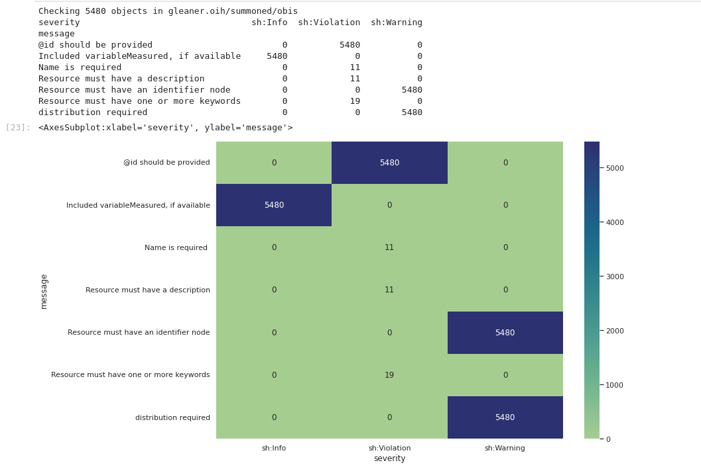

# Summary

Current work for the Ocean InfoHub contract has focused on operations and extensions.


## Overview

We can revisit the [OIH Book Personas](https://book.oceaninfohub.org/personas/persona.html) and
view current work in the context of the following relations.  


We can then further add detail to this in the following.  

From this foundation we can then review some of the activities taking place


For context:

* BLACK core organizations
  * [OIH](https://oceaninfohub.org/) root node, which develops the documentation at the GitHub Repo and in the Book.
  * [ODIS Catalogue](https://catalogue.odis.org/)
    * ODIS Catalog https://github.com/iodepo/odis-arch/blob/schema-dev-df/book/thematics/expinst/graphs/organizationv2.json
* Grey are core products
  *  [_Book_](https://book.oceaninfohub.org/index.html)
  *  [OIH Graph](https://oceans.collaborium.io/sparql.html)
* PURPLE represents our _provider_ persona where
  * Providers expose resources via web architecture that can be accessed by OIH harvesting
  * Also, other partners in the network can talk to each other using this same foundation
  

  


## Graph Elements (Pink)

### Web UIs

Current work by Derilinx is on a UI.  Work here highlights a few items:

* good descriptions and keywords are important
* as we evolve keywords, connecting these to a controlled list at some semantic level will become more and more important
* spatial information is diverse and sometimes sparse, how to complete and normalize these in a graph environment is evolving 

### Services

In addition to the graph we will want to support other indexes.  Text, 
spatial, etc.  Fortunately the machine readable format and the JSON structure
make this an easy accommodation.  

### Reports

[validation activities](https://github.com/gleanerio/notebooks/blob/master/notebooks/validation/shacl_assay.ipynb):  example SHACL run notebook

[Shape examples](https://github.com/gleanerio/notebooks/blob/master/notebooks/validation/shapes/geocodes_dcscan.ttl) example SHACL shape

[SHACL](https://github.com/iodepo/odis-arch/blob/master/code/notebooks/validation/presentation/BasicValidation.ipynb)  SHACL overview/intro

[OBIS validation example](https://github.com/gleanerio/notebooks/blob/master/notebooks/validation/shacl_assay.ipynb)

A current example of what we report (along with the [csv](https://github.com/gleanerio/notebooks/blob/master/notebooks/validation/output/obistesting.csv)) is below. Working to make this a bit more "report" like.  

  

### Graph products

[sub-graphs](https://github.com/gleanerio/notebooks/blob/master/notebooks/validation/subgraph_builder.ipynb)


## Documentation (Grey)

ODIS Catalog https://github.com/iodepo/odis-arch/blob/schema-dev-df/book/thematics/expinst/graphs/organizationv2.json

OBIS instruments https://github.com/iodepo/odis-arch/blob/schema-dev-df/book/thematics/docs/graphs/obisData.json

OBIS variables and measurements   https://github.com/iodepo/odis-arch/blob/schema-dev-df/book/thematics/docs/graphs/obisData.json   

Dataset (SOS) https://github.com/ESIPFed/science-on-schema.org/

[services example](https://book.oceaninfohub.org/thematics/services/README.html) 

spatial gazettee example (below), would need link to or provide geosparql wkt
or GeoJSON representation.  

```
{
  "@context": "https://schema.org/",
    "@type": "Place",
    "additionalProperty": {
        "@type": "PropertyValue",
        "propertyID": "Text or URL directly of or to the identifier",
        "description": "text id example or URL ID for the thing",
        "name": "Empire State Building"
    },
      "name": "Empire State Building"
}
```

--------------------------------------

## Other

* GOOS variables
* Sitegraph evolution (SHACL AF and other approaches)
* Indexing updates
    * jena + geosparql
    * job running environment
* Dashboards