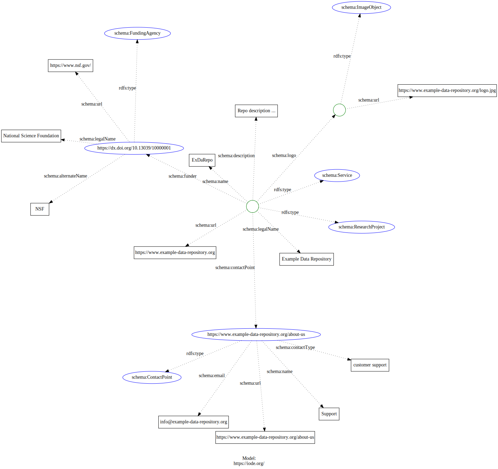

# Projects

## References


## Vocabulary resources


## Metadata elements of interest


## Notes


What defines a project?  From Schema.org:

> An enterprise (potentially individual but typically
> collaborative), planned to achieve a particular aim. Use properties from
> Organization, subOrganization/parentOrganization to indicate project sub-structures.

### Functional interest

* find collaborators
* find project gaps
* who funds what (semantic grouping)
* find duplications of funding (who is doing things already done)
* ID regional trends (what is important where) and then compare and contrast

### Notes

* [EurOcean](http://www.kg.eurocean.org/)
  * National projects in native languages
  * Use: [SeaDataNet](https://www.seadatanet.org/Metadata)
    * https://imdis.seadatanet.org/content/download/122068/file/2_1_IMDIS_2018_submission_61.pdf
    * https://www.rd-alliance.org/group/research-metadata-schemas-wg/wiki/enabling-global-data-discovery-through-structured-data
  * They have to deal with no common structure among the databases for descriptions
  * Set of fields have been aligned on with IDs
  * keywords to identify marine projects
  * Relationship with CORDIS
  * Understand the unit of knowledge being developed that can be transferred
    * How to describe unit of knowledge (ref: http://www.kg.eurocean.org/KOs)
* [ODIDO](http://www.ioc-africa.org/projects)
  * Set of parameters defined
    * Project Name
    * Country
    * Funds Source
    * Executing Agency
    * Focal Area
    * Start Date
    * End Date
    * Contact
    * Total Grant
    * Thematic Areas
    * Website
    * LME Region
    * Lead Implementing Agency
  * Current UI is a list.  Needs a way to ensure this can be crawed as a collection
    * Leverage https://schema.org/ItemList on a master index list page
* How many resources have spatial coverage
* What went in (people, funds, etc) and output (kg docs, etc)

### Ref

* https://schema.org/Project
  
### Questions

* Are these research projects?
  * https://schema.org/FundingAgency
  * https://schema.org/ResearchProject
* As distinct from institution above, correct?

I've used research project:  https://opencoredata.org/id/csdco/res/YUFL


<!-- embedme ./graphs/sosproj.json -->

```json
{
    "@context": {
        "@vocab": "https://schema.org/"
    },
    "@type": ["Service", "ResearchProject"],
    "legalName": "Example Data Repository",
    "name": "ExDaRepo",
    "url": "https://www.example-data-repository.org",
    "description": "Repo description ... ",
    "logo": {
      "@type": "ImageObject",
      "url": "https://www.example-data-repository.org/logo.jpg"
    },
    "contactPoint": {
      "@id": "https://www.example-data-repository.org/about-us",
      "@type": "ContactPoint",
      "name": "Support",
      "email": "info@example-data-repository.org",
      "url": "https://www.example-data-repository.org/about-us",
      "contactType": "customer support"
    },
    "funder": {
      "@type": "FundingAgency",
      "@id": "https://dx.doi.org/10.13039/10000001",
      "legalName": "National Science Foundation",
      "alternateName": "NSF",
      "url": "https://www.nsf.gov/"
    }
}
```




<!-- embedme ./graphs/orglist.json -->

```json
{
  "@context": {
    "@vocab": "https://schema.org/"
  },
    "@type": "ItemList",
    "url": "http://multivarki.ru?filters%5Bprice%5D%5BLTE%5D=39600",
    "numberOfItems": "315",
    "itemListElement": [
        {
            "@type": [
                "Service",
                "ResearchProject"
            ],
            "legalName": "Sample Data Repository Office",
            "name": "SDRO",
            "url": "https://www.sample-data-repository.org",
            "description": "The Sample Data Repository Service...",
            "category": [
                "Biological Oceanography",
                "Chemical Oceanography"
            ],
            "provider": {
                "@id": "https://www.sample-data-repository.org"
            },
            "parentOrganization": {
                "@type": "Organization",
                "@id": "http://www.someinstitute.edu",
                "legalName": "Some Institute",
                "name": "SI",
                "url": "http://www.someinstitute.edu",
                "address": {
                    "@type": "PostalAddress",
                    "streetAddress": "234 Main St.",
                    "addressLocality": "Anytown",
                    "addressRegion": "ST",
                    "postalCode": "12345",
                    "addressCountry": "USA"
                }
            }
        },
        {
            "@type": "Product",
            "name": "Product name"
        }
    ]
}

```


