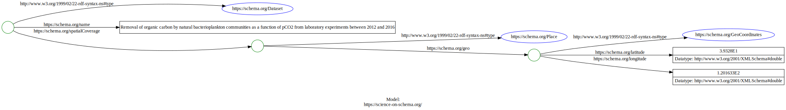
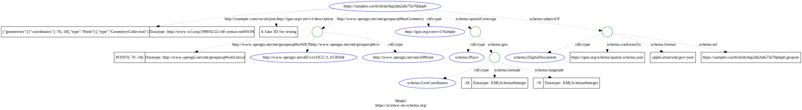

# Spatial

## About

Notes and development related to spatial data for the 
Ocean Info Hub

## References
* [Science on Schema Issue 105](https://github.com/ESIPFed/science-on-schema.org/issues/105)
  * Leverages [subjectOf](https://schema.org/subjectOf) to connect to a Thing / CreativeWork
* [schema.org/spatial](https://schema.org/spatial)
* [schema.org/GeospatialGeometry](https://schema.org/GeospatialGeometry)
* SOS patern follows:
  * [spatialCoverage](https://schema.org/spatialCoverage) -> [Place](https://schema.org/Place) -> [geo](https://schema.org/geo) -> [GeoCoordinates](https://schema.org/GeoCoordinates) OR [GeoShape](https://schema.org/GeoShape)
* Some groups are using [GeoNode](geonode.org)
* OIH is not a spatial server, but will attempt to:
  * parse spatial data from the graph. This information will likely be fed into [Koop](koop.js) where it can be accessed and pulled by participants.
  * Feed the data into a spatial aware triplestore (GeoSPARQL)

## Vocabulary Resources

* [GeoSPARQL](https://www.ogc.org/standards/geosparql)

## Metadata elements of interest

Notes here on metadata elements of interest related to spatial (not the CreateiveWork)

## Notes

Science on Schema [spatial for dataset guidance](https://github.com/ESIPFed/science-on-schema.org/blob/master/guides/Dataset.md#spatial-coverage)
```json
{
  "@context": {
    "@vocab": "https://schema.org/"
  },
  "@type": "Dataset",
  "name": "Data set name",
  "spatialCoverage": {
    "@type": "Place",
    "geo": {
      "@type": "GeoCoordinates",
      "latitude": 39.3280,
      "longitude": 120.1633
    }
  }
}
```



From the referenced SOS issue 105:

```json
{
    "@context": {
        "@version": 1.1,
        "geoblob": {
            "@id": "http://example.com/vocab/json",
            "@type": "@json"
        },
        "rdf": "http://www.w3.org/1999/02/22-rdf-syntax-ns#",
        "rdfs": "http://www.w3.org/2000/01/rdf-schema#",
        "xsd": "http://www.w3.org/2001/XMLSchema#",
        "description": "http://igsn.org/core/v1/description",
        "geosparql": "http://www.opengis.net/ont/geosparql#",
        "schema": "https://schema.org/"
    },
    "@id": "https://samples.earth/id/do/bqs2dn2u6s73o70jdup0",
    "@type": "http://igsn.org/core/v1/Sample",
    "description": "A fake ID for testing",
    "schema:subjectOf": [
        {
            "schema:url": "https://samples.earth/id/do/bqs2dn2u6s73o70jdup0.geojson",
            "@type": "schema:DigitalDocument",
            "schema:format": [
                "application/vnd.geo+json"
            ],
            "schema:conformsTo": "https://igsn.org/schema/spatial.schema.json"
        }
    ],
    "geosparql:hasGeometry": {
        "@id": "_:N98e75cacc29f40deb555eb583cb162dc",
        "@type": "http://www.opengis.net/ont/sf#Point",
        "geosparql:asWKT": {
            "@type": "http://www.opengis.net/ont/geosparql#wktLiteral",
            "@value": "POINT(-76 -18)"
        },
        "geosparql:crs": {
            "@id": "http://www.opengis.net/def/crs/OGC/1.3/CRS84"
        }
    },
    "geoblob": {
        "type": "GeometryCollection",
        "geometries": [{
            "type": "Point",
            "coordinates": [-76, -18]
        }]
    },
    "schema:spatialCoverage": {
        "@type": "schema:Place",
        "schema:geo": {
          "@type": "schema:GeoCoordinates",
          "schema:latitude": -18,
          "schema:longitude": -76
        }
      }
}
```


