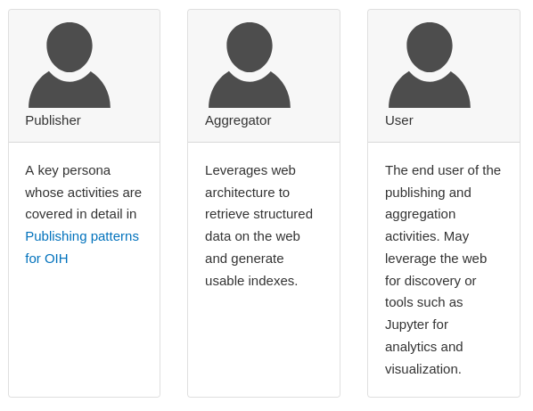

# Publishing Overview
### Ocean InfoHub

.notes: Pressing 2 will display these notes

.fx: titleslide

# presenter notes 
None at this time

---
# Outline

* Structured data on the web
* Personas
* Review of Publishing Principles

---
# Structured Data

---
# Personas

---
# Review

Briefly, a sitemap is made available that points the resources we will 
be indexing.  This can optionally be in a robots.txt file as well.  

This sitemap will provide a URL for each resource we will be indexing.  
It is fine if it providers more too, those resources simply wont express 
any JSON-LD content.  You can also have multiple sitemaps we ones specificly
focused on the resources to index.  

Each URL or page represented in the index are then accessed and parsed for the 
JSON-LD content.  
 

.fx: smallest

---
# Thank you

