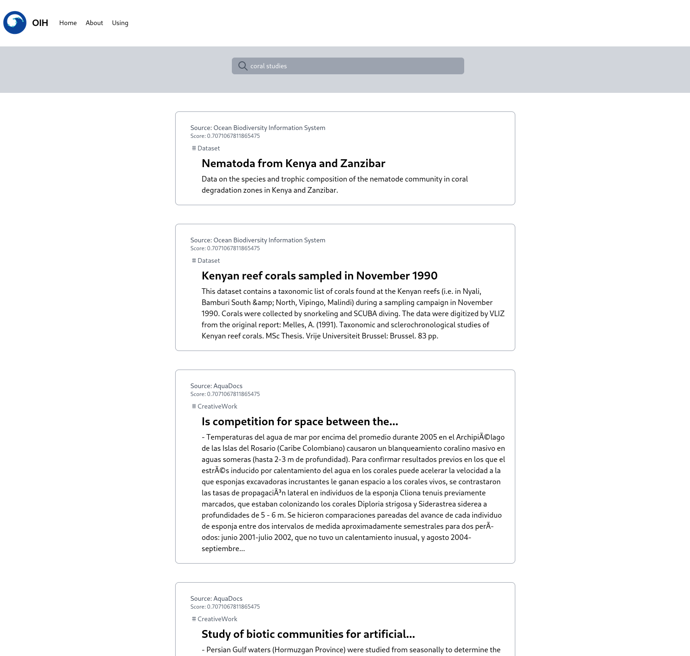

# Querying Overview
### Ocean InfoHub

.notes: Pressing 2 will display these notes

.fx: titleslide

# presenter notes 
None at this time

---
# Outline

* User Experiences
* The SPARQL query language
* OIH SPARQL
* APIs

---
# User Experiences

When we think UX, we typically think about the
web. 

* https://oceans.collaborium.io/
* https://oceans.collaborium.io/sparql.html

There is more we can do with the infrastructure,
that is behind this. 

.fx: smallest

---
# The SPARQL query language

Visit references

---
# OIH SPARQL

Visit references

---
# APIs

Visit references

---
# Thank you

