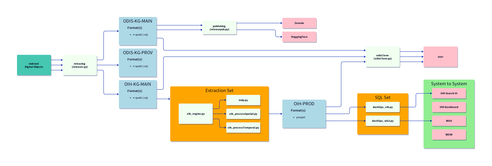
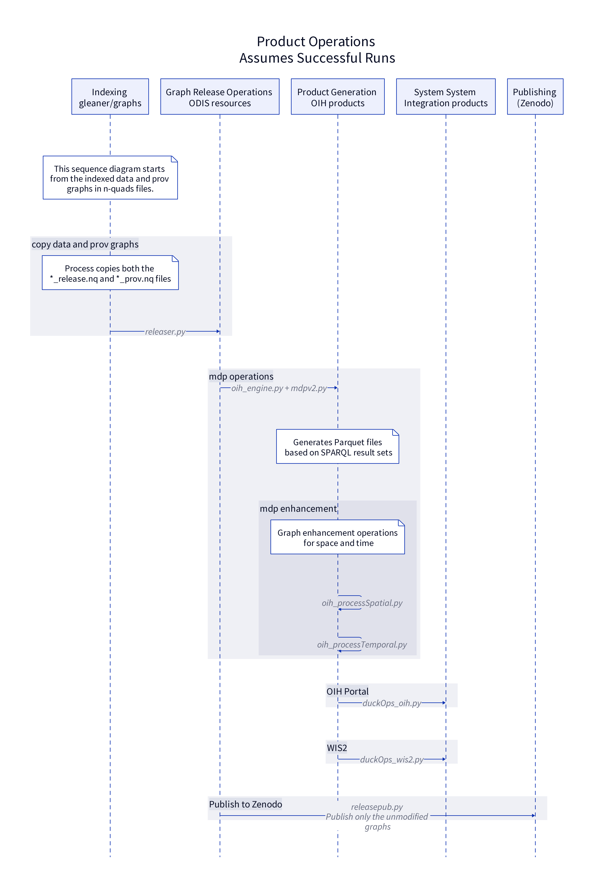

# Graph Operations (graphOps)

## Intro



## ODIS / OIH Workflows

### Indexing & Release Graph generation

Gleaner operations via Scheduler (Dagster)

### Product Generation

[README.md](extraction/mdp/README.md)

```bash
mdpv2.py  [runner.sh]
```

```bash
oih_processSpatial.py
```

```bash
oih_processTemporal.py
```

### System System Integration Products

[README.md](sqlOps/README.md)

#### OIH Portal

```bash
duckOps_oih.py
```

#### WIS

```bash
duckOps_wis2.py
```

### Publishing

[README.md](publishing/README.md)

```bash
releasepub.py
```

## Sequence Diagram



## User Workflows

For workflows desrigned for individual users or data science operations
look at:

Cloning: [README.md](users/odisClone/README.md)

Notebooks:  [README.md](notebooks/README.md)

Graph Visualizations: [README.md](users/graphVisualization/README.md)
