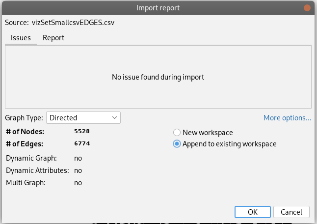
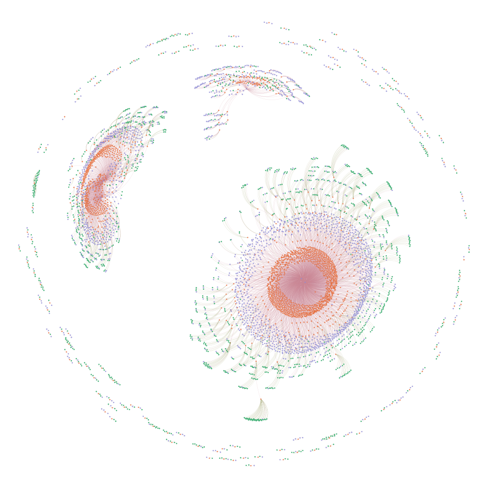

# Graph View

## Quickstart

1. Using the selectQuery.rq search the graph and store the SPARQL results as CSV
2. use trhe csv2network.py to generate the nodes and edges files
3. Load these into Gephi.  
   1. Use the File:import spreadsheet menu item
   2. When you load the second file, be sure to append it to the project, see image below
4. Enjoy, play with the animations to spread out the graph and coloring for the node types.

## Output

Some example output.  Here the colors are:

* purple: Organization
* green: Dataset
* orange: Course
* blue: Person

> Note:  This is old and imcomplete data (likely at 
> least a year old), but it is what I had
> loaded locally to test with.  This is a test to build the 
> pipeline, not the current product.

## About

Building off the core product, the code here generates files that can be
used in graph visualization.

The core targets for output include [GML](https://en.wikipedia.org/wiki/Graph_Modelling_Language)
and some of the following column based encodings. 

These could pair wise such as

| source | target |
|--------|--------|
| a      | b      |
| c      | b      |
| b      | d      |

An example of this can be seen in the London Tube Map at [Example Data | Graphia](https://graphia.app/example-data.html).

We could imagine a more complex relationship to express with something like:

| Subject IRI | Name | predicate | object literal |   |   |
|-------------|------|-----------|----------------|---|---|
|             |      |           |                |   |   |
|             |      |           |                |   |   |
|             |      |           |                |   |   |

