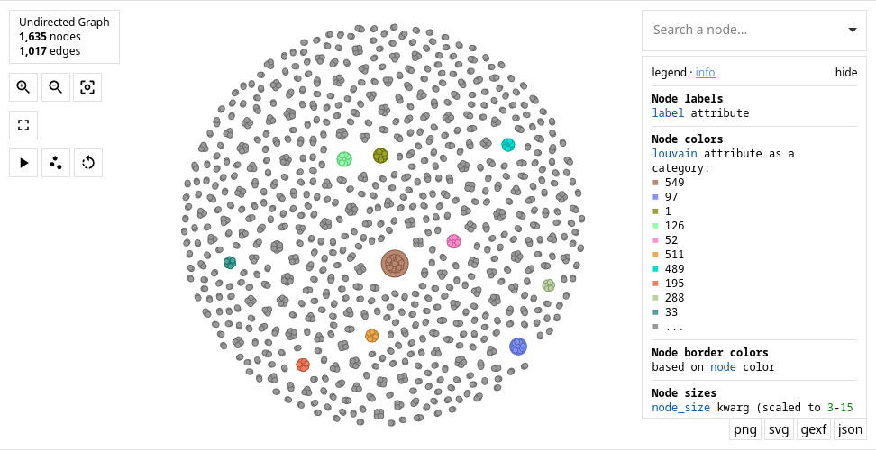
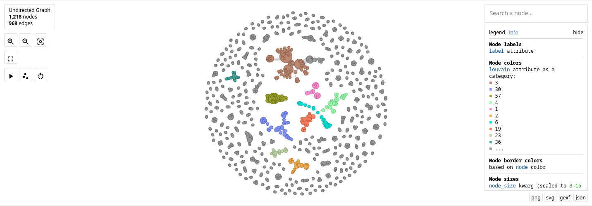

# An example application of PIDs

## About

The following is just an example of some data that involved _people_.

In the first case, resources are linked to people simply by their name.  When that is done, even if the name is the same and the person is actually the same, the graph has no way of knowing this.

The result is that every instance of a person if a node on the graph.  The result is seen below.

However, if we provide a unique ID to each person and use the ID as the point of reference.  The graph will _share_ that node (instance of a person) across all the resources that reference it. 

The result is that we can see the relation between people and resources.  The result is seen below.

