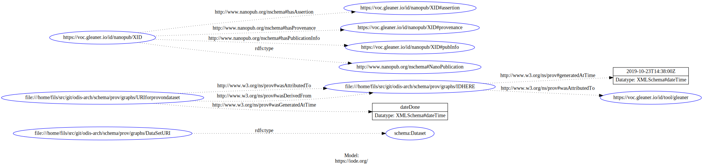

# Prov

## About

This is the start of some discussion on issues around prov tracking in OIH.
This may take two paths.  One would be the prov tracking indexers might do
and the other prov that providers would encode to provide specific prov
the community requests.

## Example

This is a basic prov example to begin with.  Note, this is a draft and
the ID connections and examples have not been made yet.  


<!-- embedme ./graphs/nanoprov.json -->
```json
{
  "@context": {
    "gleaner": "https://voc.gleaner.io/id/",
    "np": "http://www.nanopub.org/nschema#",
    "prov": "http://www.w3.org/ns/prov#",
    "xsd": "http://www.w3.org/2001/XMLSchema#"
  },
  "@set": [
    {
      "@id": "gleaner:nanopub/XID",    
      "@type": "np:NanoPublication",
      "np:hasAssertion": {
        "@id": "gleaner:nanopub/XID#assertion"
      },
      "np:hasProvenance": {
        "@id": "gleaner:nanopub/XID#provenance"
      },
      "np:hasPublicationInfo": {
        "@id": "gleaner:nanopub/XID#pubInfo"
      }
    },
    {
      "@id": "gleaner:nanopub/XID#assertion",
      "@graph": {
        "@id": "DataSetURI",
        "@type": "schema:Dataset",
        "description": "This is where you would put corrections or annotations",
        "identifier": [
          {
            "@type": "schema:PropertyValue",
            "name": "GraphSHA",
            "description": "A SHA256 sha stamp on the harvested data graph from a URL",
            "value": "{{SHA256 HASH HERE}}"
          },
          {
            "@type": "schema:PropertyValue",
            "name": "ProviderID",
            "description": "The id provided with the data graph by the provider",
            "value": "{{re3 or URL noted in config}}"
          },
          {
            "@type": "schema:PropertyValue",
            "name": "URL",
            "description": "The URL harvested by gleaner",
            "value": "{{The URL the JSON-LD came from}}"
          }
        ]
      }
    },
    {
      "@id": "gleaner:nanopub/XID#provenance",
      "@graph": {
        "@id": "URI for prov on data set",
        "prov:wasGeneratedAtTime": {
          "@value": "{{ The date done   like 2019-10-20T11:54:00Z}}",
          "@type": "xsd:dateTime"
        },
        "prov:wasDerivedFrom": {
          "@id": "URL of the resources and/or  @id from resource"
        },
        "prov:wasAttributedTo": {
          "@id": "Can I put the Institution base URl or ID here"
        }
      }
    },
    {
      "@id": "gleaner:nanopub/XID#pubInfo",
      "@graph": {
        "@id": "the nanopub info ID",
        "prov:wasAttributedTo": {
          "@id": "gleaner:tool/gleaner"
        },
        "prov:generatedAtTime": {
          "@value": "2019-10-23T14:38:00Z",
          "@type": "xsd:dateTime"
        }
      }
    }
  ]
}

```

