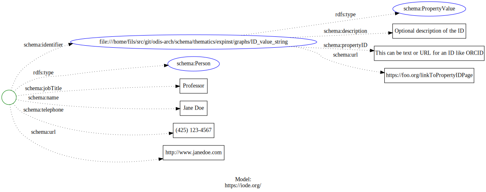
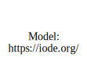

# Experts and Institutions

## About

For experts and institutions we will be leveraging the Person and Organization types from 
schema.org.  

At a minimum, for people, we would have to have name, contact information and 
affiliation.  More detailed records would include persistent identifiers.


### Refs

* [schema:Person](https://schema.org/Person)
* [scheme:Organization](https://schema.org/Organization)
* [Science on Schema Repository](https://github.com/ESIPFed/science-on-schema.org/blob/master/guides/DataRepository.md)
* [https://oceanexpert.org/](https://oceanexpert.org/)
  * [Example page expert](https://oceanexpert.org/expert/44151)
  * [Example page institution](https://oceanexpert.org/institution/10171)
  * [Work done by Adam Leadbetter years ago](https://gist.github.com/adamml/58ebdc7fc3f8ab8dad5d8852a28fb28c)

For organization we can look at the work of Science on Schema for Data Repository and
work from there.

For institution see also the projects section below.  Note that in Organization there 
many specific types we can use at the bottom.
  

<!-- embedme ./graphs/person.json -->

```json
{
    "@context": {
        "@vocab": "https://schema.org/"
    },
    "@type": "Person",
    "name": "Jane Doe",
    "jobTitle": "Professor",
    "telephone": "(425) 123-4567",
    "url": "http://www.janedoe.com", 
    "identifier":
    {
      "@id": "ID_value_string",
      "@type": "PropertyValue",
      "propertyID": "This can be text or URL for an ID like ORCID",
      "url": "https://foo.org/linkToPropertyIDPage",
      "description": "Optional description of the ID"
    }
}
```




<!-- embedme ./graphs/organization.json -->

```json
{
    "@context": {
        "@vocab": "https://schema.org/"
    },
    "@id": "https://link.to/PID_like_re3_or_others",
    "@type": "Organization",
    "name": "Foo Inc.",
    "address": {
        "@type": "PostalAddress",
        "addressLocality": "Paris, France",
        "postalCode": "F-75002",
        "streetAddress": "38 avenue de l'Opera"
    },
    "email": "secretariat(at)foo.org",
    "telephone": "( 33 1) 42 68 53 00",
    "faxNumber": "( 33 1) 42 68 53 01",
    "member": [
        {
            "@type": "Organization"
        },
        {
            "@type": "Organization"
        }
    ],
    "alumni": [
        {
            "@type": "Person",
            "name": "Jack Dan"
        },
        {
            "@type": "Person",
            "name": "John Smith"
        }
    ],
    "identifier": {
        "@id": "ID_value_string",
        "@type": "PropertyValue",
        "propertyID": "this can be text or URL..",
        "url": "https://foo.org/linkToPropertyIDPage",
        "description": "Optional description of the ID"
    }
}
```



### Notes
* https://oceanexpert.org/  (example https://oceanexpert.org/expert/17820)
* https://geoblueplanet.org/2019/09/25/oceanscape-portal-launch/ & https://oceanscape.org/ (example https://oceanscape.org/organisation/institute-for-marine-and-antarctic-studies/)
  
