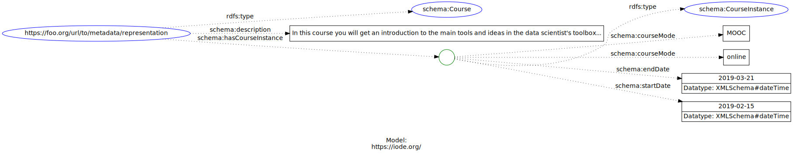
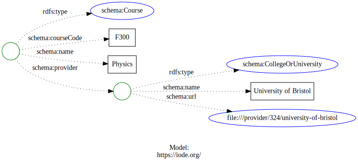

# Training

## References

* https://www.w3.org/TR/xmlschema11-2/
  * Use YYYY-MM-DDThh:mm:ss or YYYY-MM-DD
* [http://www.marinetraining.eu/](http://www.marinetraining.eu/)
  * [Example page](http://www.marinetraining.eu/node/1001)
* [https://oceanexpert.org/](https://oceanexpert.org/)
  * [Example page](https://oceanexpert.org/expert/17820)
  * https://oceanexpert.org/event/2859 
* [OCTO](https://www.octogroup.org/)
* https://oceansummerschools.iode.org/ 
* https://www.openchannels.org/upcoming-events-list 
* https://catalogue.odis.org/search/type=16 
* https://clmeplus.org/

## Vocabulary resources


* [https://schema.org/LearningResource](https://schema.org/LearningResource) 
* [https://schema.org/Course](https://schema.org/Course)

## Metadata elements of interest

* POGO shipboard training and other other groups

## Notes

### Note from Schema.org site on this resource

>> LearningResource is expected to be used as an addition to a primary type such as Book, Video, Product etc.

>>EducationEvent serves a similar purpose for event-like things (e.g. a Trip). A LearningResource may be created as a result of an EducationEvent, for example by recording one.

So the following examples are only for the sub-graph of the training which by guidance should hang off a higher level type like Product.  There product could then be referenced by a type Organization as a service provided.

<!-- embedme ./graphs/course1.json -->

```json
{
    "@context": {
        "@vocab": "https://schema.org/",
        "endDate": {
            "@type": "http://www.w3.org/2001/XMLSchema#dateTime"
        },
        "startDate": {
            "@type": "http://www.w3.org/2001/XMLSchema#dateTime"
        }
    },
    "@id": "https://foo.org/url/to/metadata/representation",
    "@type": "Course",
    "description": "In this course you will get an introduction to the main tools and ideas in the data scientist's toolbox...",
    "hasCourseInstance": {
        "@type": "CourseInstance",
        "courseMode": [
            "MOOC",
            "online"
        ],
        "endDate": "2019-03-21",
        "startDate": "2019-02-15"
    }
}
```




<!-- embedme ./graphs/course2.json -->

```json
{
    "@context": {
        "@vocab": "https://schema.org/"
    },
    "@type": "Course",
    "courseCode": "F300",
    "name": "Physics",
    "provider": {
        "@type": "CollegeOrUniversity",
        "name": "University of Bristol",
        "url": {
            "@id": "/provider/324/university-of-bristol"
        }
    }
}
```


