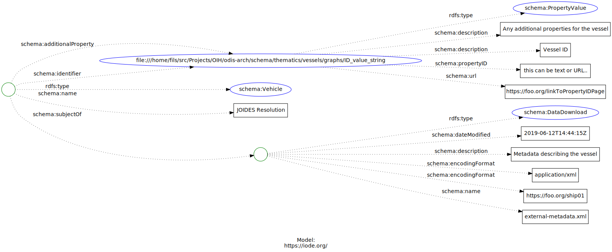

# Vessels

## About

Exploring using schema.org to describe research vessels. 

<!-- embedme ./graphs/ship.json -->

```json
{
    "@context": {
        "@vocab": "https://schema.org/"
    },
    "@type": "Vehicle",
    "name": "JOIDES Resolution",
    "identifier":
    {
      "@id": "ID_value_string",
      "@type": "PropertyValue",
      "propertyID": "this can be text or URL..",
      "url": "https://foo.org/linkToPropertyIDPage",
      "description": "Vessel ID "
    },
    "additionalProperty" : {
        "@id": "ID_value_string",
        "@type": "PropertyValue",
        "propertyID": "this can be text or URL..",
        "url": "https://foo.org/linkToPropertyIDPage",
        "description": "Any additional properties for the vessel"
    }
}
```



## References

* POGO
  * BODC connection?
  * Vessel db, cruise report db and planned cruises db
  * service links to cruise report etc..  
  * Interop with SeaDataNet?
* EurOcean
* [SeaDataNet](https://www.seadatanet.org/)
* [Marine Facilities Planner](https://www.marinefacilitiesplanning.com/)
* [EuroFleets](https://www.eurofleets.eu/)

ICES ref: https://ocean.ices.dk/codes/ShipCodes.aspx 
DataCite can do DOIs for cruises..   (need reference)  This is done as an Event in DataCite K4  (DataCite is cross referenced to schema.org already (?) so look for event mapping)
Ref: https://www.bodc.ac.uk/resources/vocabularies/vocabulary_search/C17/ 


Managed by SeaDataNet

NOCD Code, Call Sign, ICES Shipcode, MMSI Code, IMO Code those are the identifiers on our database 
