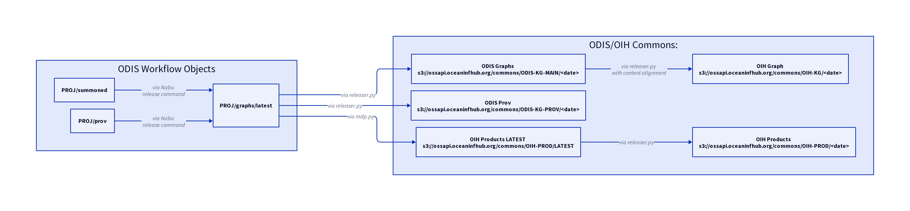
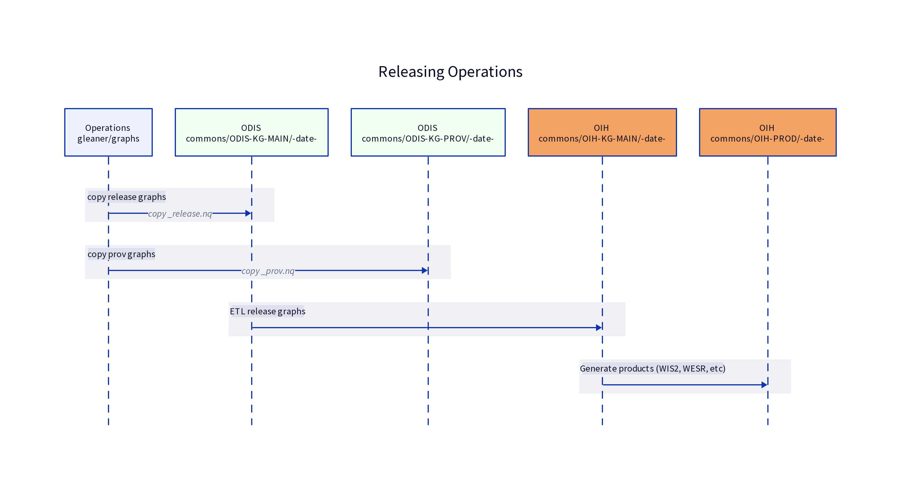

# Bucket and Prefix values for ODIS 

## Summary 

The following sections describe the process of release graphs and graph derived products from the ODIS/OIH workflows. The result is a set of products exposed via S3 or associated HTTPS URLs representing various products.

For example, a graph released by ODIS for the Canadian CIOOS project in Feb of 2024 would look like:

```
s3://ossapi.oceaninfhub.org/commons/ODIS-KG-MAIN/202402/cioos_release.nq
```

The associated ODIS PROV would be at

```
s3://ossapi.oceaninfhub.org/commons/ODIS-KG-MAIN/202402/cioos_prov.nq
```
A product derived from these ODIS sources by OIH would look like

```
s3://ossapi.oceaninfhub.org/commons/OIH-KG/202402/cioos_release.nt
```

And an OIH product for use in the search and dashboard would be found at

```
s3://ossapi.oceaninfhub.org/commons/OIH-PROD/202402/cioos.parquet
```

## ODIS Workflow Objects



The diagram above gives a simple picture of how objects flow.  In this diagram the ODIS Workflow Objects represent the objects collected from the partners during the scheduled harvest events.  These are the various JSON-LD data graphs published following the ODIS guidance.  These reside in the PROJ/summoned and PROJ/prov buckets. The prov bucket here is provenance data, in W3C PROV, of the ODIS activities and not the provenance as represented by the providers.  That later, publisher provided prov, is in the data graphs in accordance with ODIS guidance. 

These are then collected into single graph objects in the PROJ/graph/latest bucket prefix.  These objects are single files in RDF n-quads format.   They represent the current snapshot of a provider graph in the exact form they publish, now with all the various statement triples in a single file.  

### ODIS/OIH Commons

Digital object flow.




#### ODIS-KG-MAIN
This is the primary ODIS graph set of products.  There is one graph per provider in this prefix.  Note, due to the ambiguity in schema.org namespace.   Reference the Vocabulary Definition Files at https://schema.org/docs/developers.html.  

#### ODIS-KG-PROV
This is W3C Prov data for the process of indexing done by ODIS.  This is only the provenance of the ODIS activity and does not represent the provenance of the resources in the graph.  That provenance, if available, is provided by the partners.  

#### OIH-PROD
This prefix represents the various products made by OIH from the ODIS-KG-* objects.  These can be in various formats.  Current and in development products include:

Parquet files holding the results of SPARQL queries on the ODIS-KH-* objects to pre-generate result sets.  These are used both my the OIH Dashboard and the OIH Search Portal
GeoJSON files to support integration work underway with WMO
Other products to support integration work underway with WESER and others.  

#### OIH-KG
This is the ODIS-KG-MAIN, now aligned to a common namespace for the schema.org vocabulary.  


__Naming Conventions__

The buckets of data described above can be represented in the public S3 API convention for access as follows. 

```
s3://ossapi.oceaninfhub.org/commons/ODIS-KG-MAIN/<date>
s3://ossapi.oceaninfhub.org/commons/ODIS-KG-PROV/<date>
s3://ossapi.oceaninfhub.org/commons/OIH-KG/<date>
s3://ossapi.oceaninfhub.org/commons/OIH-PROD/<date>
```

Note that within OIH-PROD will reside various products for specific formats for groups.   Example might be:

```
s3://ossapi.oceaninfhub.org/commons/OIH-PROD/WESR/<date>
s3://ossapi.oceaninfhub.org/commons/OIH-PROD/WIS2/<date>
s3://ossapi.oceaninfhub.org/commons/OIH-PROD/AQUAINFRA/<date>
```

The <date> will follow the ISO 8601 convention and be done on a granularity of months as daily releases are not needed. Should a situation arise where another release is needed in a single calendar month we will then use the day.

In this approach the year format as YYYY, the year/month format as YYYY-MM, and the year/month/day format as either YYYYMMDD (basic format) or YYYY-MM-DD (extended format).  We will use the basic format in our prefix naming.

Examples of these paths would be:

```
s3://ossapi.oceaninfhub.org/commons/ODIS-KG-MAIN/202402
```

If another release was done in February 2024, it would look like:

```
s3://ossapi.oceaninfhub.org/commons/ODIS-KG-MAIN/20240229
```

### OIH Latest Special Case

There is one special case prefix that exists to support the more real time nature of the search portal and dashboard.  As these are intended to represent the status of the ODIS/OIH workflows as near real time to the current state of the index as possible, these items are updated day and date with the indexing process.  

OIH-PROD LATEST is found at the path:

```
s3://ossapi.oceaninfhub.org/commons/OIH-PROD/LATEST
```

### Zenodo Publishing

The intent and code to support the process of Zenodo publishing is under late stage development.  Current work will be quickly modified to align to this publishing pattern. The objects in the common can be published to Zenodo for DOIs.  This would be done at the <date> level with collections in each date being a potential Zenodo published snapshot.  

Note, the OIH-PROD/LATEST prefix detailed previously is not part of the publishing pipeline for Zenodo.


### OIH Triplestore Publishing

Workflow to update triplestore

Interop

The concept of interop with these release graphs might be addressed with the use of SHACL shapes.  A collection of shape files that the graph validates against provide a basis for the creation of SPARQL queries or other queries that work against the graph.

Accessing ODIS/OIH resources with in-process tooling

A key goal of this workflow is to enable in-process access and analytics of the data with minimal infrastructure and associated support.  To do this, the workflow leverages several cloud native approaches such as S3 based objects stores and cloud native formats such as Parquet.  

In doing so a set of open source and cross platform tooling becomes available to the community.  Two examples of these include DuckDB (https://duckdb.org/) and Kuzu (https://kuzudb.com/).   There are many more examples like Polars, Pandas and other packages that can leverage this same distribution approach to enable online analytical processing (OLAP) operations.

This enables ODIS/OIH to support broad community interest in and use of the resources in the commons without major infrastructure investment.  As online transaction processing (OLTP) operations are not use cases of ODIS/OIH no system are presently needed to support this approach. 

Examples of these in-process OLAP approaches in easy to share and document notebooks are in development.  

inprocessExplorer.ipynb


References

* DataCite
* Common Crawl
* OpenAire
* OpenAlex


# SCRATCH PAD

Some things that are not well thought out..   Might be useless (or useful ) 

WIS2Geojson is defined by a schema.  So reference the schema with these products in the same way I would put the SHACL shapes with the graph.
Do SHACL shapes define an "identity query" in SPARQL?  No, since an identity query would be all the triples for a single subject IRI
